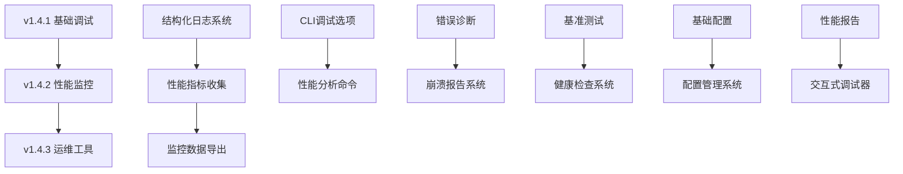

# 📅 XQPath 调试维测能力实施时间表

## 🗓️ 整体时间规划

```
         Week 1    Week 2    Week 3    Week 4    Week 5    Week 6    Week 7    Week 8    Week 9    Week 10   Week 11   Week 12
v1.4.1   [████████][████████][███████ ]
                                     └─ v1.4.1 发布
v1.4.2                        [████████][████████][████████][███████ ]
                                                                     └─ v1.4.2 发布
v1.4.3                                                      [████████][████████][████████][███████ ]
                                                                                                   └─ v1.4.3 发布
```

## 🔄 版本间依赖关系



## 📊 详细实施计划

### v1.4.1 基础调试能力 (第 1-3 周)

#### Week 1: 核心基础设施

- **Day 1-2**: 项目结构调整和依赖添加

  ```bash
  # 添加新依赖到 Cargo.toml
  tracing = "0.1"
  tracing-subscriber = "0.3"
  tracing-appender = "0.2"
  serde = { version = "1.0", features = ["derive"] }
  clap = { version = "4.0", features = ["derive"] }
  ```

- **Day 3-4**: 实现结构化日志系统

  ```
  src/logging/
  ├── mod.rs           # 日志模块主文件
  ├── config.rs        # 日志配置
  ├── formatter.rs     # 日志格式化器
  └── appender.rs      # 日志输出器
  ```

- **Day 5-7**: CLI 调试选项集成

  ```rust
  // src/cli.rs 增强
  #[derive(Parser)]
  pub struct DebugArgs {
      #[arg(long)]
      pub debug: bool,

      #[arg(long, default_value = "info")]
      pub log_level: String,

      #[arg(long)]
      pub log_file: Option<PathBuf>,

      #[arg(long)]
      pub timing: bool,
  }
  ```

#### Week 2: 错误处理增强

- **Day 8-10**: 实现增强的错误诊断系统
- **Day 11-12**: 添加错误恢复机制和建议
- **Day 13-14**: 基础性能监控集成

#### Week 3: 测试和文档

- **Day 15-17**: 全面测试覆盖（单元测试、集成测试）
- **Day 18-19**: 用户文档编写和示例更新
- **Day 20-21**: v1.4.1 发布准备和发布

### v1.4.2 性能监控分析 (第 4-7 周)

#### Week 4: 性能指标系统

- **Day 22-24**: 实现性能指标收集框架
- **Day 25-26**: 添加内存和 CPU 监控
- **Day 27-28**: 实现性能数据存储

#### Week 5: 基准测试框架

- **Day 29-31**: 集成 criterion 基准测试
- **Day 32-33**: 创建性能回归检测
- **Day 34-35**: 实现基准测试自动化

#### Week 6: 性能分析工具

- **Day 36-38**: 开发性能分析命令
- **Day 39-40**: 实现性能报告生成
- **Day 41-42**: 添加性能可视化

#### Week 7: 测试和发布

- **Day 43-45**: 性能测试和优化
- **Day 46-47**: 文档更新和示例补充
- **Day 48-49**: v1.4.2 发布

### v1.4.3 运维监控工具 (第 8-12 周)

#### Week 8: 健康检查系统

- **Day 50-52**: 实现系统健康检查框架
- **Day 53-54**: 添加自动诊断功能
- **Day 55-56**: 实现修复建议系统

#### Week 9: 配置管理系统

- **Day 57-59**: 开发配置管理框架
- **Day 60-61**: 实现配置验证和热重载
- **Day 62-63**: 添加配置模板系统

#### Week 10: 交互式调试器

- **Day 64-66**: 构建调试器核心框架
- **Day 67-68**: 实现调试命令和界面
- **Day 69-70**: 添加高级调试功能

#### Week 11: 崩溃报告和监控

- **Day 71-73**: 实现崩溃报告系统
- **Day 74-75**: 开发监控数据导出
- **Day 76-77**: 集成监控系统

#### Week 12: 最终测试和发布

- **Day 78-80**: 综合系统测试
- **Day 81-82**: 文档完善和用户指南
- **Day 83-84**: v1.4.3 正式发布

## ⚡ 里程碑检查点

### 🎯 Week 3 Checkpoint (v1.4.1)

**验收标准:**

- [ ] 所有日志输出使用 tracing 框架
- [ ] CLI 支持所有调试参数
- [ ] 错误信息包含详细上下文和建议
- [ ] 基础性能统计功能正常
- [ ] 89+ 个测试全部通过
- [ ] 文档更新完成

### 🎯 Week 7 Checkpoint (v1.4.2)

**验收标准:**

- [ ] 性能指标收集覆盖所有关键操作
- [ ] 基准测试套件包含 20+ 个测试场景
- [ ] 性能报告支持 HTML 和 JSON 格式
- [ ] 内存使用监控精度 < 1MB
- [ ] 性能回归检测灵敏度 > 95%
- [ ] Grafana 仪表板可用

### 🎯 Week 12 Checkpoint (v1.4.3)

**验收标准:**

- [ ] 健康检查覆盖 15+ 个检查项
- [ ] 配置系统支持完整的 YAML 配置
- [ ] 交互式调试器支持 20+ 个命令
- [ ] 崩溃报告包含完整的诊断信息
- [ ] 监控数据支持 3+ 种导出格式
- [ ] 系统稳定性 > 99.9%

## 🚨 风险缓解计划

### 高风险事项

1. **性能回归风险**

   - 缓解策略：每个功能都有性能基准测试
   - 检查频率：每次 commit 自动检查
   - 回滚标准：性能下降 > 10%

2. **依赖兼容性风险**

   - 缓解策略：锁定依赖版本，分阶段升级
   - 测试策略：多个 Rust 版本交叉测试
   - 备选方案：准备依赖替换方案

3. **用户体验回归风险**
   - 缓解策略：向后兼容保证，渐进式功能启用
   - 用户反馈：每个版本发布后 1 周内收集反馈
   - 快速修复：严重问题 24 小时内修复

### 中风险事项

1. **开发进度延迟**

   - 缓解策略：功能优先级排序，核心功能优先
   - 监控指标：每周进度检查，延迟 > 2 天触发调整
   - 应急预案：功能分批发布，延迟非核心功能

2. **代码质量下降**
   - 缓解策略：代码审查，自动化质量检查
   - 质量门禁：测试覆盖率 > 90%，clippy 0 警告
   - 持续改进：每周代码质量报告

## 📈 成功指标追踪

### 开发效率指标

- **功能交付率**: 计划功能 vs 实际交付功能
- **代码质量**: 测试覆盖率、Clippy 警告数、文档覆盖率
- **性能基准**: 核心操作性能变化趋势

### 用户体验指标

- **使用便利性**: 新功能采用率、用户反馈评分
- **问题解决效率**: Bug 发现到修复时间、崩溃率下降
- **文档质量**: 文档访问量、用户自助解决问题比率

### 系统稳定性指标

- **可靠性**: 崩溃率、错误率、恢复时间
- **性能**: 响应时间、内存使用、CPU 占用
- **兼容性**: 不同平台测试通过率、依赖兼容性

这个时间表为 XQPath 的调试和维测能力提升提供了详细的路线图，确保每个阶段都有明确的目标和验收标准。
